## Histogram of uncleaned data

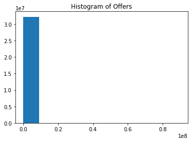

## Histogram after removing 0.5% of most extreme values
Many people had offered $0, and there were a fairly large number of offers with 
absurdly high values (north of $1 mil and as high as $90 mil). Removal of extreme values reduces the range to [1-6000], which is extremely skewed. 

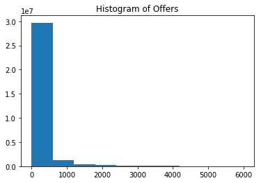

# Common Values
## Percentiles for the top 1% of most common values in the original data
    0.5% : 1.50
    1% : 2.00
    5% : 5.55
    10% : 9.25
    25% : 25.99
    50% : 98.00
    75% : 430.00
    90% : 1550.00
    95% : 3100.00
    99% : 8500.00
    99.5% : 10000.00
    Max : 15000.00
As you can see, some of these fall outside the [$1 - $6000] range of the reduced data

## Histograms of data binned at most common values

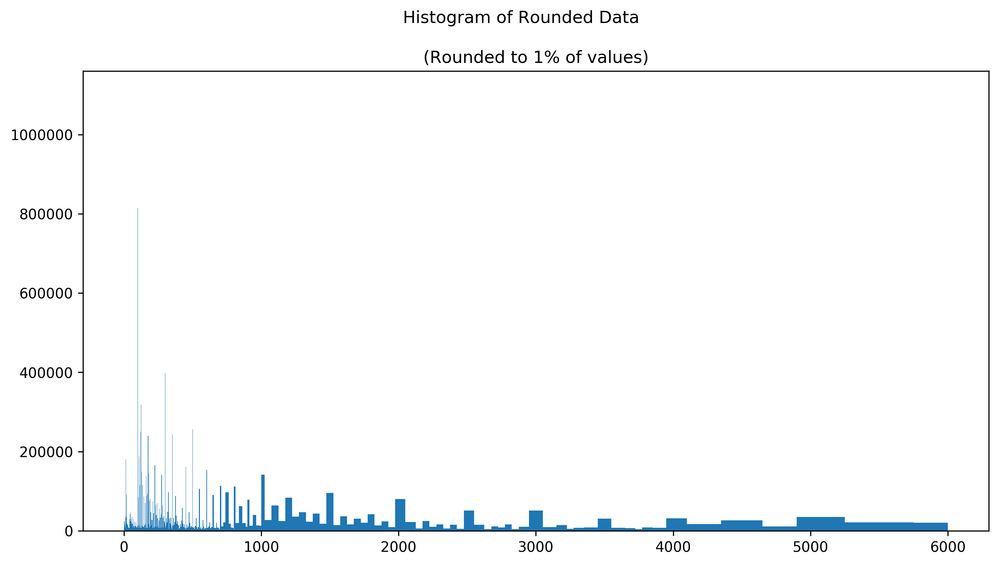

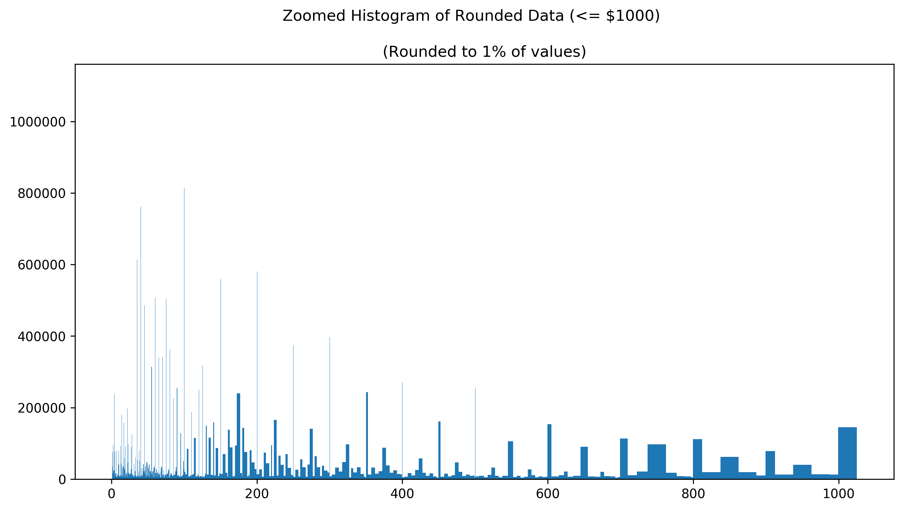

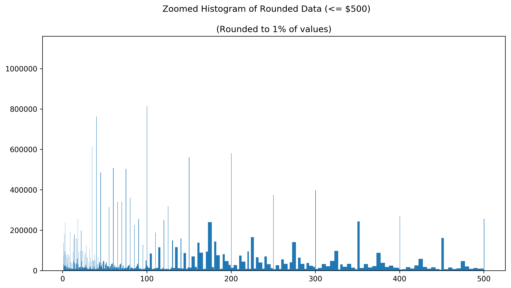

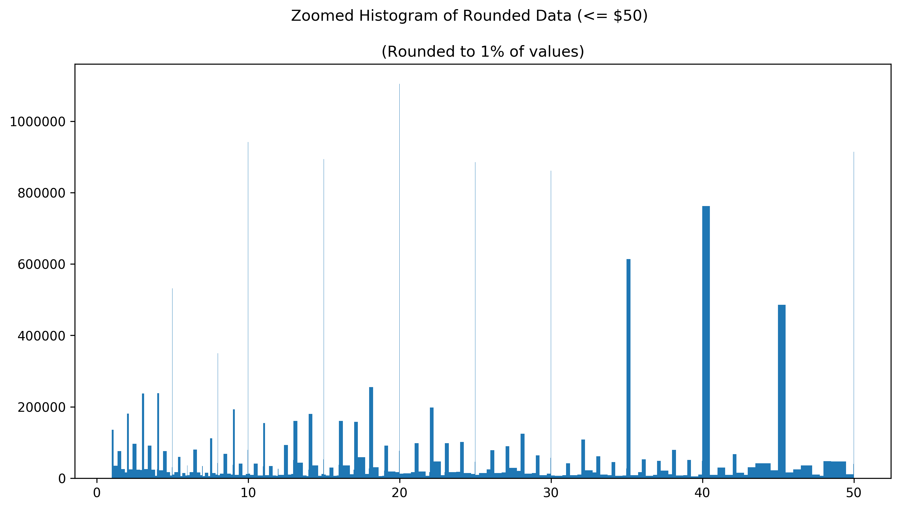

    [1105405.  942053.  914540.  894061.  885651.  861661.  811876.  755958.
      609403.  578893.]

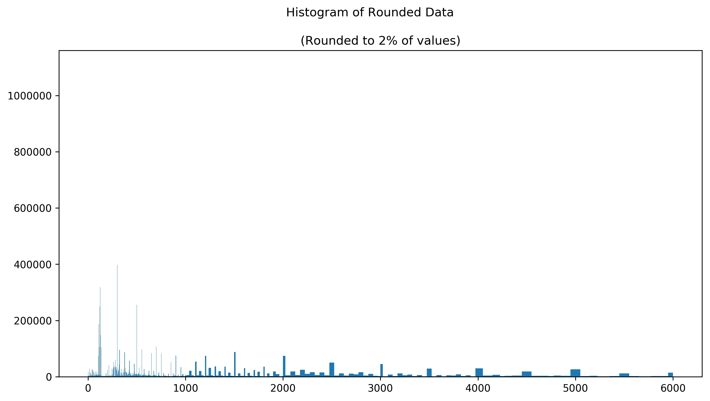

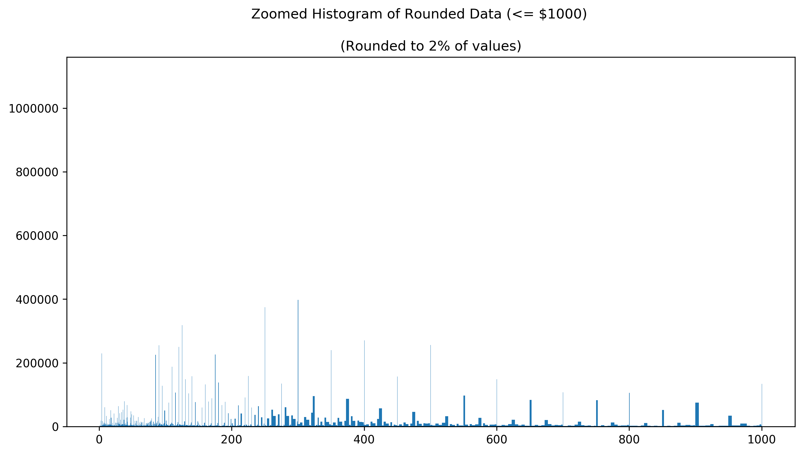

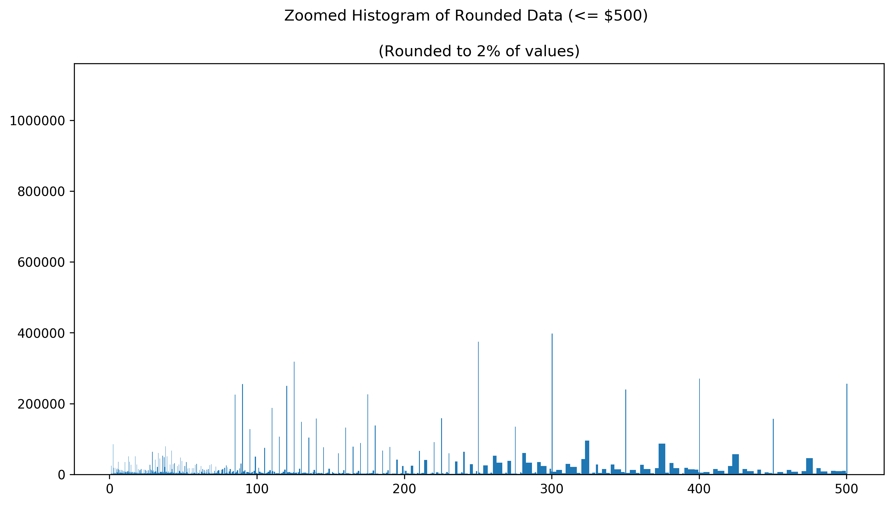

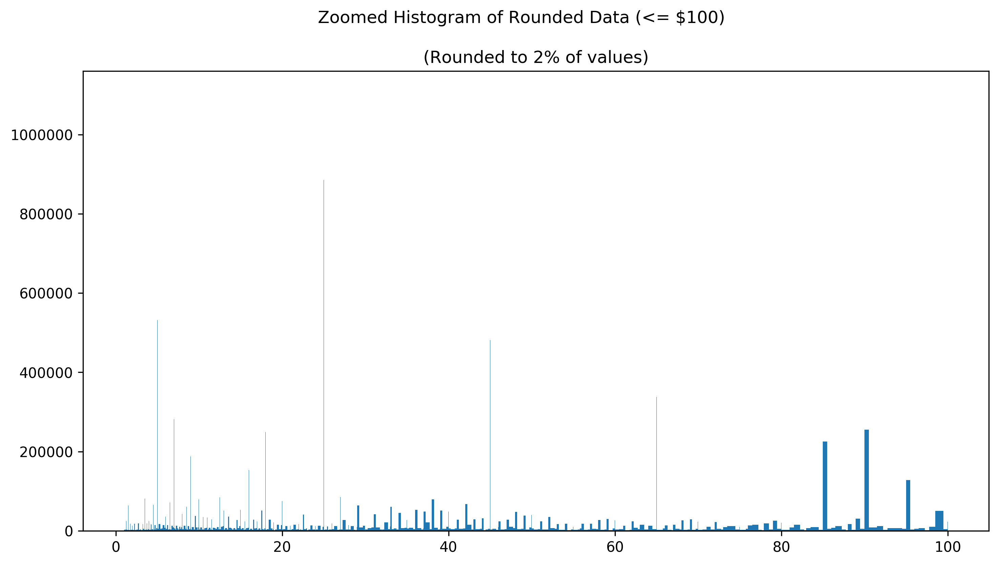

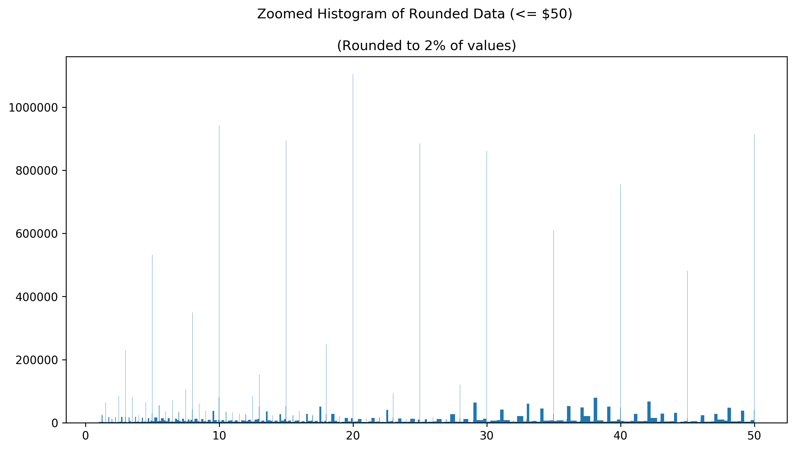

